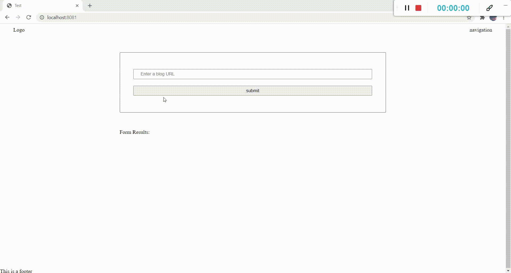

# Evaluate News NLP
The "Evaluate News NLP" is the final project for the webpack section in the react/redux nanodegree at udacity.
The goal of this project is to enter an URL to a blog post or an article and receive sentimental analysis about this 
article using the meaningcloud api.

## Features:

* The user enter a blog post or an article url.
* if the user enters unvalid url an alert messgae will pop up.
* Using the meaningcloud api we perform sentimental analysis on the content of the blog post. 
* The results of the analysis show up in the UI. 
* Service Workers is added for offline functionality. 
* Testing functionality using jest. 

## Project Setup

* install the dependencies - `npm install`
* run the client side - `npm run build-prod`
* run the server - `npm start`
* for testing run - `npm run test`

## Project Demo

